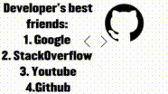

  

  

<!-- Badges -->

  
  

## 🛠️ Skills

| Languages | Frameworks | Tools & Platforms |
| ----------------------- | -------------------- | ----------------- |
| PHP, JavaScript, Python | Laravel, NextJS, Vue | Git, GitHub CI/CD |

<h2>🚀 Featured Projects</h2>

<table>
  <thead>
    <tr>
      <th>Project</th>
      <th>Description</th>
      <th>Link</th>
    </tr>
  </thead>
  <tbody>
    <tr>
      <td><strong>Laravel CMS App</strong></td>
      <td>CMS with robust system to handle user authentication, content management, and basic CRUD operations.</td>
      <td><a href="https://github.com/Dirga36/belajar-laravel.V2.git">GitHub</a></td>
    </tr>
    <tr>
      <td><strong>TaskTracker</strong></td>
      <td>A simple command-line interface (CLI) tool to manage tasks.</td>
      <td><a href="https://github.com/Dirga36/Task-Tracker.git">GitHub</a></td>
    </tr>
  </tbody>
</table>

## 📊 GitHub Stats

  
  

## 📄 [My Portfolio](https://dirga36.github.io/Dirga36/)

## 📞 Contact

- 📫 Email me: <fuaddabbad@gmail.com>
- 🔗 [LinkedIn](httwww.linkedin.com/in/fu-ad-husnan-10481a30b)
